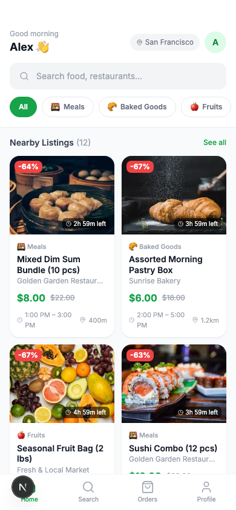
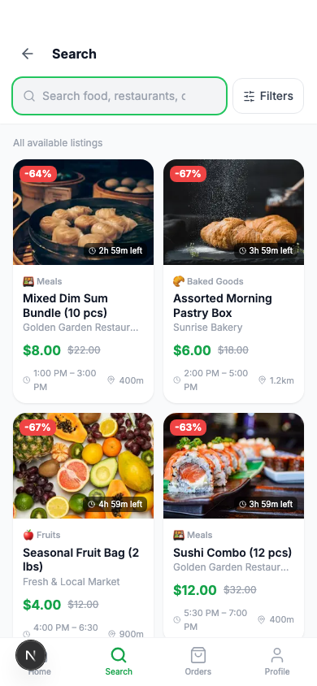
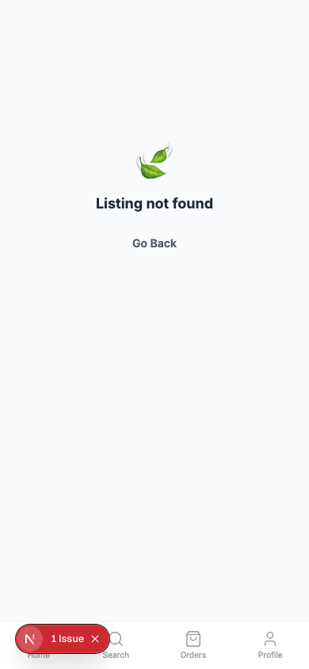
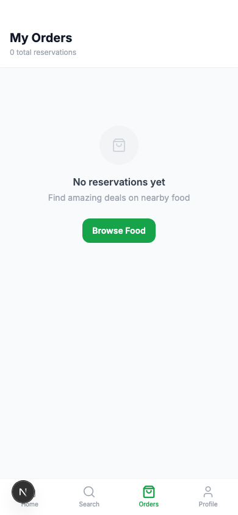
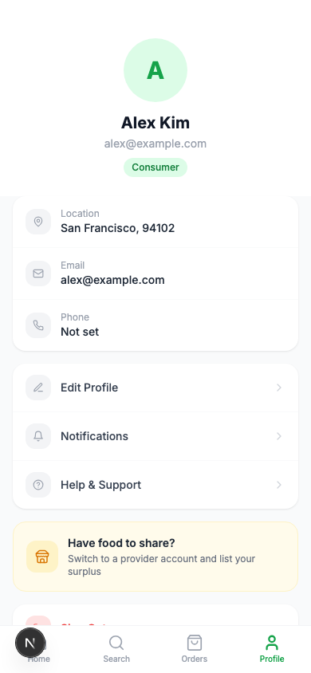
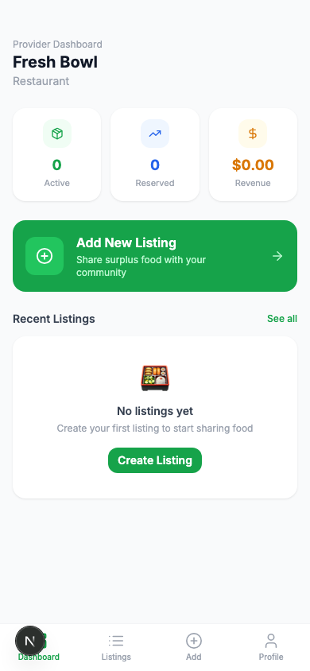
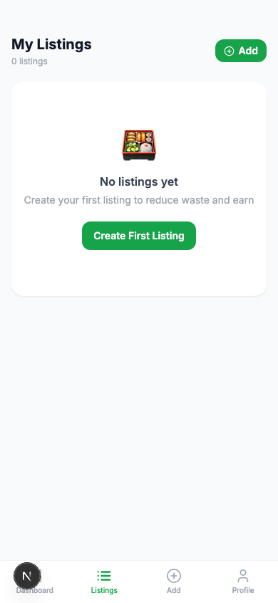
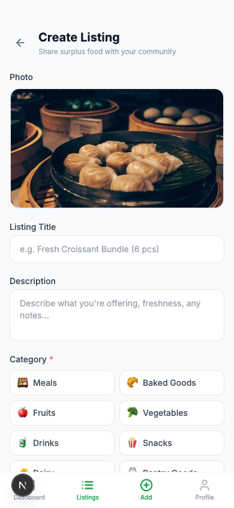

# NibbleNet

> **A network for sharing extra food.**

NibbleNet is a lightweight prototype web app that connects people with surplus food to nearby consumers who want affordable food while helping reduce food waste. Restaurants, bakeries, grocery stores, and even households can share surplus — but only after completing a safety-first provider approval process.

---

## Overview

Food waste is a massive problem. NibbleNet helps by making it easy to list and discover surplus food at up to 70% off, while keeping the exchange safe, trustworthy, and community-driven.

**Key principle:** Anyone can browse and reserve food. But to *post* food, you must apply to become a verified provider. NibbleNet reviews every application before allowing listings.

---

## Key Features

### For Consumers (All Users)
- Browse nearby food listings sorted by distance
- Filter by category (Meals, Baked Goods, Fruits, etc.) and cuisine tags
- Full-text search with price range filters
- Allergy & sensitivity profile — hide listings containing your allergens from the home feed
- Reserve items with quantity picker and receive a confirmation code
- Inspect items at pickup — cancel if the item doesn't match the listing

### For Approved Providers
- Create and manage food listings with photos, pricing, and pickup windows
- Dashboard with stats: active listings, total reservations, revenue
- Allergen tagging on each listing for consumer transparency
- Real-time listing status: available → sold out as reservations come in

---

## Unified User Model

Every user creates a single standard account. There is **no separate "Provider" account type** at sign-up.

| Status | Access |
|--------|--------|
| `none` | Browse and reserve food as a consumer |
| `pending` | Application submitted — awaiting review |
| `approved` | Full provider access — can create and manage listings |
| `rejected` | Application denied |

---

## Provider Verification Flow

Before posting any food, users must complete a 4-step application:

**Step 1 — Provider Type**
Choose from: Restaurant, Grocery Store, Bakery / Cafe, Household, or Other Food Business.

**Step 2 — Identity & Verification Details**
- Businesses: business name, address, optional license number
- Households: contact name and address

**Step 3 — Safety & Integrity Policy**
Read and acknowledge prohibited items. This includes: illegal substances, tampered food, misleading listings, unsafe or contaminated items, and anything that poses a health risk. Violations result in immediate removal.

**Step 4 — Food Safety Acknowledgement**
Agree to food handling standards covering cooked foods, raw foods, packaged groceries, and perishables. Providers must also acknowledge that consumers can inspect and decline items at pickup.

> In the prototype, applications can be instantly approved via a "Simulate Approval" button on the pending screen. In production, approval would happen via an admin review.

---

## Allergy & Sensitivity Filtering

Users can save an allergy profile in their account settings:

- Peanuts, Tree Nuts, Dairy, Eggs, Shellfish, Soy, Gluten, Sesame

**Behavior:**
- **Home feed / browsing:** Listings containing saved allergens are automatically hidden
- **Search:** Allergen filtering is not applied — all results appear so users can make informed decisions

Providers tag allergens on each listing. This data powers the filtering.

---

## Consumer Pickup Inspection

NibbleNet takes consumer safety seriously at the point of exchange:

- Consumers are entitled to inspect items before accepting
- If the item doesn't match the listing or appears unsafe, they may cancel the reservation at pickup
- Providers must accept these cancellations without dispute (agreed to during onboarding)

---

## Tech Stack

- **Next.js 16** (App Router, Turbopack)
- **React 18** with Context API + `useReducer`
- **Tailwind CSS 3.4** with custom green brand palette
- **Lucide React** for icons
- **TypeScript**
- No backend — all data is mocked and persisted via `localStorage`
- Geolocation via browser `navigator.geolocation` API with Haversine distance calculation

---

## Getting Started

```bash
npm install
npm run dev       # http://localhost:3000
npm run build
npm run lint
```

### Demo Account

| Email | Password |
|-------|----------|
| demo@nibblen.com | demo123 |

The demo account starts as a regular consumer. To try the provider flow, use the in-app "Become a Provider" option and click **Simulate Approval** on the pending screen.

---

## Project Structure

```
src/
├── app/
│   ├── (consumer)/         # All-user routes (home, search, listing, reservations, profile)
│   ├── (provider)/         # Approved-provider-only routes (dashboard, listings, create)
│   ├── become-a-provider/  # Provider program intro page
│   ├── provider-apply/     # 4-step application form
│   ├── provider-pending/   # Pending approval screen
│   ├── login/
│   ├── onboarding/
│   └── page.tsx            # Landing / splash
├── components/
│   ├── layout/             # BottomNav (consumer), ProviderNav, IPhoneFrame
│   ├── listing/            # ListingCard, FilterSheet
│   ├── reservation/        # ReservationCard
│   └── ui/                 # Button, Input, Modal, Badge
├── context/
│   ├── AuthContext.tsx     # User session, provider status, allergy profile
│   └── DataContext.tsx     # Listings, reservations, allergen filtering
├── hooks/
│   └── useGeolocation.ts   # Browser Geolocation API wrapper
├── lib/
│   ├── mock-data.ts        # 12 listings with allergen tags, 4 demo users
│   └── utils.ts            # Helpers, ALLERGENS constant, haversineKm
└── types/
    └── index.ts            # User, Listing, Reservation, ProviderStatus, Allergen types
```

---

## Future Roadmap

- **Admin review panel** — real provider application review workflow
- **Real-time notifications** — listing updates, reservation confirmations
- **iOS / mobile app** — the architecture is mobile-first and ready for React Native adaptation
- **Map view** — visualize nearby providers on an interactive map
- **Provider ratings** — consumer reviews after successful pickups
- **Push notifications** — alert consumers when new nearby listings are posted
- **Payment integration** — in-app payment at reservation for higher-trust exchanges

---

## Branding

**NibbleNet** = *A network for sharing extra food.*

The name reflects the idea of a connected community — a "net" of neighbors, businesses, and households sharing small amounts ("nibbles") of surplus food. Green-first brand palette emphasizes sustainability, freshness, and trust.

---

## Testing

Playwright is configured for E2E tests:

```bash
npx playwright test
```

---

## Screenshots

### Consumer
| Landing | Login | Home Feed | Search |
|---------|-------|-----------|--------|
|  |  |  |  |

| Listing Detail | Reservations | Profile |
|----------------|--------------|---------|
|  |  |  |

### Provider
| Dashboard | Listings | Create Listing |
|-----------|----------|----------------|
|  |  |  |
